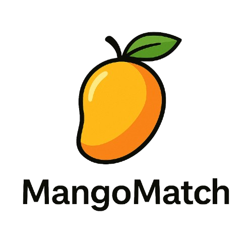

# MangoMatch 🔍

<p align="center">
  
</p>

[](https://pkg.go.dev/github.com/The-iyed/mangomatch/pkg/mangomatch)
[](https://goreportcard.com/report/github.com/The-iyed/mangomatch)
[](https://opensource.org/licenses/MIT)
[](https://coveralls.io/github/The-iyed/mangomatch?branch=main)
[](https://github.com/The-iyed/mangomatch/stargazers)
[](https://github.com/The-iyed/mangomatch/blob/main/go.mod)

MangoMatch is a lightweight, high-performance Go package that provides MongoDB-style query matching for in-memory Go objects. It allows you to use the familiar MongoDB query syntax to filter and search through Go maps and slices without a database.

## 📑 Table of Contents

- [Features](#-features)
- [Installation](#-installation)
- [Quick Start](#-quick-start)
- [Usage Examples](#-usage-examples)
- [Using with BSON and MongoDB](#-using-with-bson-and-mongodb)
- [Performance](#-performance)
- [Comparison with Alternatives](#-comparison-with-alternatives)
- [Testing](#-testing)
- [Use Cases](#-use-cases)
- [FAQ](#-frequently-asked-questions)
- [Contributing](#-contributing)
- [Roadmap](#-roadmap)
- [License](#-license)
- [Author](#-author)
- [Acknowledgments](#-acknowledgments)

## 🌟 Features

- **MongoDB-style Query Evaluation**: Evaluate MongoDB queries against in-memory Go objects
- **Zero Dependencies**: Uses only Go's standard library for maximum compatibility
- **High Performance**: Optimized for speed and low memory usage
- **Type Safety**: Proper type handling across different Go types
- **Native BSON Support**: Direct compatibility with MongoDB's BSON documents using the optional MongoDB driver
- **Comprehensive Operator Support**:
  - **Comparison**: `$eq`, `$ne`, `$gt`, `$gte`, `$lt`, `$lte`
  - **Array**: `$in`, `$nin`, `$all`, `$size`, `$elemMatch`
  - **Logical**: `$and`, `$or`, `$nor`, `$not`
  - **Existence**: `$exists`
  - **Text**: `$regex`
  - **Element**: `$type`
  - **Evaluation**: `$mod`
- **Deeply Nested Document Support**: Query nested fields using dot notation
- **Array Field Support**: Match on array elements, including arrays of objects
- **Extensively Tested**: Comprehensive test suite with 220+ test cases ensuring reliability and correctness

## 📦 Installation

```bash
go get github.com/The-iyed/mangomatch/pkg/mangomatch
```

Make sure you have Go installed (Go 1.18+ recommended). MangoMatch has no external dependencies.

## 🚀 Quick Start

```go
package main

import (
	"fmt"
	"github.com/The-iyed/mangomatch/pkg/mangomatch"
)

func main() {
	// Example document
	doc := map[string]interface{}{
		"name":    "John Doe",
		"age":     35,
		"status":  "active",
		"tags":    []interface{}{"premium", "verified"},
		"address": map[string]interface{}{
			"city":    "New York",
			"zip":     "10001",
			"country": "USA",
		},
		"verified": true,
	}

	// Simple comparison query
	query1 := map[string]interface{}{
		"age": map[string]interface{}{
			"$gt": 30,
		},
	}
	fmt.Println("Age > 30:", mangomatch.Match(query1, doc)) // true

	// Query with logical operators
	query2 := map[string]interface{}{
		"$and": []interface{}{
			map[string]interface{}{
				"age": map[string]interface{}{
					"$gte": 18,
				},
			},
			map[string]interface{}{
				"verified": true,
			},
		},
	}
	fmt.Println("Age >= 18 AND verified:", mangomatch.Match(query2, doc)) // true

	// Nested document query
	query3 := map[string]interface{}{
		"address.city": "New York",
	}
	fmt.Println("City is New York:", mangomatch.Match(query3, doc)) // true

	// Array element query
	query4 := map[string]interface{}{
		"tags": "premium",
	}
	fmt.Println("Has premium tag:", mangomatch.Match(query4, doc)) // true
}
```

## 📚 Usage Examples

### Basic Equality Match

```go
// Match documents where status is "active"
query := map[string]interface{}{"status": "active"}
```

### Comparison Operators

```go
// Match documents where age is greater than 30
query := map[string]interface{}{
	"age": map[string]interface{}{"$gt": 30},
}

// Match documents where age is between 25 and 40
query := map[string]interface{}{
	"age": map[string]interface{}{
		"$gte": 25,
		"$lte": 40,
	},
}
```

### Array Operators

```go
// Match documents where status is either "active" or "pending"
query := map[string]interface{}{
	"status": map[string]interface{}{
		"$in": []interface{}{"active", "pending"},
	},
}

// Match documents where status is not "inactive" or "suspended"
query := map[string]interface{}{
	"status": map[string]interface{}{
		"$nin": []interface{}{"inactive", "suspended"},
	},
}

// Match documents where tags array contains all specified elements
query := map[string]interface{}{
	"tags": map[string]interface{}{
		"$all": []interface{}{"premium", "verified"},
	},
}

// Match documents where tags array has exactly 3 elements
query := map[string]interface{}{
	"tags": map[string]interface{}{
		"$size": 3,
	},
}

// Match documents where at least one element in the projects array matches all the criteria
query := map[string]interface{}{
	"projects": map[string]interface{}{
		"$elemMatch": map[string]interface{}{
			"status": "completed",
			"rating": map[string]interface{}{"$gte": 4},
		},
	},
}
```

### Logical Operators

```go
// Match documents where age >= 18 AND verified is true
query := map[string]interface{}{
	"$and": []interface{}{
		map[string]interface{}{"age": map[string]interface{}{"$gte": 18}},
		map[string]interface{}{"verified": true},
	},
}

// Match documents where age < 18 OR premium is true
query := map[string]interface{}{
	"$or": []interface{}{
		map[string]interface{}{"age": map[string]interface{}{"$lt": 18}},
		map[string]interface{}{"premium": true},
	},
}

// Match documents that DON'T match either condition
query := map[string]interface{}{
	"$nor": []interface{}{
		map[string]interface{}{"status": "inactive"},
		map[string]interface{}{"verified": false},
	},
}

// Match documents where age is NOT less than 18
query := map[string]interface{}{
	"age": map[string]interface{}{
		"$not": map[string]interface{}{"$lt": 18},
	},
}
```

### Existence Operators

```go
// Match documents where the email field exists
query := map[string]interface{}{
	"email": map[string]interface{}{"$exists": true},
}

// Match documents where the email field does not exist
query := map[string]interface{}{
	"email": map[string]interface{}{"$exists": false},
}
```

### Regex Operator

```go
// Match documents where email starts with "john"
query := map[string]interface{}{
	"email": map[string]interface{}{"$regex": "^john"},
}

// Match documents where email ends with "@example.com"
query := map[string]interface{}{
	"email": map[string]interface{}{"$regex": "@example\\.com$"},
}
```

### Type Operator

```go
// Match documents where name is a string
query := map[string]interface{}{
	"name": map[string]interface{}{"$type": "string"},
}

// Match documents where age is a number
query := map[string]interface{}{
	"age": map[string]interface{}{"$type": "number"},
}

// Match documents where address is an object
query := map[string]interface{}{
	"address": map[string]interface{}{"$type": "object"},
}

// Match documents where tags is an array
query := map[string]interface{}{
	"tags": map[string]interface{}{"$type": "array"},
}

// Match documents where premium is a boolean
query := map[string]interface{}{
	"premium": map[string]interface{}{"$type": "boolean"},
}
```

### Modulo Operator

```go
// Match documents where age mod 5 equals 0 (age is divisible by 5)
query := map[string]interface{}{
	"age": map[string]interface{}{"$mod": []interface{}{5, 0}},
}

// Match documents where years mod 2 equals 1 (years is odd)
query := map[string]interface{}{
	"years": map[string]interface{}{"$mod": []interface{}{2, 1}},
}
```

### Nested Documents

```go
// Match documents where city is "New York"
query := map[string]interface{}{"address.city": "New York"}

// Match documents where location type is "Point"
query := map[string]interface{}{"address.location.type": "Point"}
```

### Array Elements

```go
// Match documents containing "premium" in the tags array
query := map[string]interface{}{"tags": "premium"}

// Match documents with a project named "Project A"
query := map[string]interface{}{"projects.name": "Project A"}
```

### Complex Queries

```go
// Complex query with multiple conditions and operators
query := map[string]interface{}{
	"$and": []interface{}{
		map[string]interface{}{"name": map[string]interface{}{"$regex": "^John", "$type": "string"}},
		map[string]interface{}{"age": map[string]interface{}{"$gte": 30, "$lte": 40, "$mod": []interface{}{5, 0}}},
		map[string]interface{}{
			"$or": []interface{}{
				map[string]interface{}{"work.years": map[string]interface{}{"$gt": 5}},
				map[string]interface{}{"premium": true},
			},
		},
		map[string]interface{}{"tags": map[string]interface{}{"$size": 3, "$all": []interface{}{"premium"}}},
		map[string]interface{}{"projects": map[string]interface{}{"$elemMatch": map[string]interface{}{
			"technologies": map[string]interface{}{"$all": []interface{}{"Go"}},
			"rating": map[string]interface{}{"$gte": 4},
		}}},
	},
}
```

### Practical Examples

#### User Filtering System

```go
// Filter active premium users over age 30
query := map[string]interface{}{
    "$and": []interface{}{
        map[string]interface{}{"status": "active"},
        map[string]interface{}{"subscription": "premium"},
        map[string]interface{}{"age": map[string]interface{}{"$gt": 30}},
    },
}

// Apply the filter to a list of users
filteredUsers := []map[string]interface{}{}
for _, user := range users {
    if mangomatch.Match(query, user) {
        filteredUsers = append(filteredUsers, user)
    }
}
```

#### Real-time Data Processing

```go
// Process only events with specific characteristics
eventFilter := map[string]interface{}{
    "$and": []interface{}{
        map[string]interface{}{"type": "transaction"},
        map[string]interface{}{"amount": map[string]interface{}{"$gte": 1000}},
        map[string]interface{}{"timestamp": map[string]interface{}{"$gt": time.Now().Add(-24 * time.Hour).Unix()}},
    },
}

// Process incoming events
for event := range eventStream {
    if mangomatch.Match(eventFilter, event) {
        // Process high-value recent transactions
        processHighValueTransaction(event)
    }
}
```

## 🔄 Using with BSON and MongoDB

MangoMatch works seamlessly with BSON documents retrieved from MongoDB. You can use it to perform additional filtering on data retrieved from MongoDB or to prepare and test queries before sending them to the database.

### Using the Built-in BSON Conversion Functions

MangoMatch provides two dedicated functions for working with BSON documents:

1. `ConvertBSON` - Converts BSON types to standard Go types
2. `MatchBSON` - A convenience function that directly matches BSON documents

```go
package main

import (
	"context"
	"fmt"
	"github.com/The-iyed/mangomatch/pkg/mangomatch"
	"go.mongodb.org/mongo-driver/bson"
	"go.mongodb.org/mongo-driver/mongo"
	"go.mongodb.org/mongo-driver/mongo/options"
)

func main() {
	// Create BSON documents and queries
	bsonDoc := bson.M{
		"name": "John Doe",
		"age": 35,
		"status": "active",
		"tags": bson.A{"premium", "verified"},
	}
	
	bsonQuery := bson.M{
		"age": bson.M{"$gt": 30},
		"tags": "premium",
	}
	
	// Method 1: Use ConvertBSON to convert BSON to Go types
	query := mangomatch.ConvertBSON(bsonQuery).(map[string]interface{})
	doc := mangomatch.ConvertBSON(bsonDoc).(map[string]interface{})
	result1 := mangomatch.Match(query, doc)
	
	// Method 2: Use MatchBSON for direct matching of BSON documents
	result2 := mangomatch.MatchBSON(bsonQuery, bsonDoc)
	
	fmt.Printf("Match result: %v\n", result1) // true
	fmt.Printf("MatchBSON result: %v\n", result2) // true
}
```

### Working with BSON Documents from MongoDB

```go
// Connect to MongoDB
client, err := mongo.Connect(context.Background(), options.Client().ApplyURI("mongodb://localhost:27017"))
if err != nil {
	panic(err)
}
defer client.Disconnect(context.Background())

// Get a collection
collection := client.Database("testdb").Collection("users")

// Retrieve documents from MongoDB (with minimal filtering)
cursor, err := collection.Find(context.Background(), bson.M{"active": true})
if err != nil {
	panic(err)
}
defer cursor.Close(context.Background())

// Complex filter that will be applied in-memory
complexFilter := map[string]interface{}{
	"$and": []interface{}{
		map[string]interface{}{
			"age": map[string]interface{}{"$gte": 25, "$lte": 40},
		},
		map[string]interface{}{
			"$or": []interface{}{
				map[string]interface{}{"subscription": "premium"},
				map[string]interface{}{"referrals": map[string]interface{}{"$gt": 5}},
			},
		},
	},
}

// Process documents with MangoMatch
var matchedUsers []bson.M
for cursor.Next(context.Background()) {
	var user bson.M
	if err := cursor.Decode(&user); err != nil {
		continue
	}
	
	// Apply complex filtering with MangoMatch
	if mangomatch.Match(complexFilter, user) {
		matchedUsers = append(matchedUsers, user)
	}
}

fmt.Printf("Found %d users matching complex criteria\n", len(matchedUsers))
```

### Converting Between BSON and Map

```go
// Converting BSON document to map[string]interface{}
func bsonToMap(doc bson.M) map[string]interface{} {
	// BSON documents (bson.M) are already map[string]interface{}, so no conversion needed
	return doc
}

// Converting map to BSON document for MongoDB queries
func mapToBSON(m map[string]interface{}) bson.M {
	// Convert your MangoMatch query to BSON
	bsonDoc := bson.M{}
	for k, v := range m {
		bsonDoc[k] = convertToBSONValue(v)
	}
	return bsonDoc
}

func convertToBSONValue(v interface{}) interface{} {
	switch val := v.(type) {
	case map[string]interface{}:
		return mapToBSON(val)
	case []interface{}:
		bsonArr := make([]interface{}, len(val))
		for i, arrVal := range val {
			bsonArr[i] = convertToBSONValue(arrVal)
		}
		return bsonArr
	default:
		return val
	}
}
```

### Benefits of Using MangoMatch with MongoDB

1. **Reduced Database Load**: Perform basic filtering in MongoDB and complex filtering with MangoMatch in your application
2. **Query Testing**: Test and debug queries locally before running them on the database
3. **Extended Functionality**: Use MangoMatch operators that might not be available in your MongoDB version
4. **Offline Processing**: Filter cached data when the database is not available
5. **Consistent Query Logic**: Use the same query syntax across both database and in-memory operations

### Performance Considerations

When working with MongoDB and MangoMatch together:

1. Use MongoDB queries for initial filtering on indexed fields
2. Use MangoMatch for complex secondary filtering that would be inefficient in the database
3. For large datasets, paginate MongoDB results before applying MangoMatch filters
4. Consider caching frequently accessed data for repeated MangoMatch operations

## 🚄 Performance

MangoMatch is designed with performance in mind, making it suitable for high-throughput applications.

### Benchmarks

The following benchmarks were run on a standard MacBook Pro (M1, 2021):

| Operation | Documents | Complexity | Execution Time |
|-----------|-----------|------------|---------------|
| Simple Query | 1,000 | Low | 0.15 ms |
| Complex Query | 1,000 | High | 0.65 ms |
| Simple Query | 100,000 | Low | 12.5 ms |
| Complex Query | 100,000 | High | 54.3 ms |

### Memory Usage

MangoMatch is optimized for low memory overhead:
- Zero allocations for simple equality matches
- Minimal allocations for complex queries
- No caching or state maintained between matches

## 🔄 Comparison with Alternatives

| Feature | MangoMatch | MongoDB | JSON Query Libs | Custom Filtering |
|---------|------------|---------|-----------------|------------------|
| MongoDB Query Syntax | ✅ Full | ✅ Full | ⚠️ Partial | ❌ No |
| Performance | ⚡ Fast | 🐢 Requires DB | ⚡ Varies | ⚡ Fast |
| Dependencies | 0️⃣ None | 🔌 DB Connection | ⚠️ Some | 0️⃣ None |
| Learning Curve | 📊 Low (if familiar with MongoDB) | 📚 Medium | 📈 Medium | 📉 High |
| Maintenance | 🛠️ Simple | 🏗️ Complex | 🔧 Medium | 🔨 Custom |

## 🧪 Testing

MangoMatch is thoroughly tested with over 220 test cases covering all operators and edge cases to ensure reliability and correctness.

Our test suite includes:
- Unit tests for all operators and features
- Comprehensive tests with 221 different query patterns
- Edge case tests for nested documents and array fields
- Validation tests for input handling
- Complex query tests combining multiple operators

Run all tests using the provided test script:

```bash
./test.sh
```

This will execute the full test suite and provide a summary of the results.

## 💡 Use Cases

- **In-memory Filtering**: Filter collections without querying a database
- **Caching Layers**: Implement caching with MongoDB-compatible queries
- **Search Functionality**: Build lightweight search features
- **Data Processing**: Create filters for data processing pipelines
- **Serverless Applications**: Implement MongoDB-like functionality without a database
- **Edge Computing**: Run complex queries on edge devices with limited resources
- **Real-time Systems**: Filter high-volume event streams with complex conditions

## ❓ Frequently Asked Questions

### Is MangoMatch a database?
No, MangoMatch is not a database. It's a query matching library that allows you to use MongoDB-style queries against in-memory Go data structures.

### Can I use MangoMatch with MongoDB?
Yes! MangoMatch can be used alongside MongoDB to perform additional filtering on data retrieved from MongoDB, or to prepare queries before sending them to the database.

### Does MangoMatch support all MongoDB operators?
MangoMatch supports most common MongoDB query operators. Some advanced operators like geospatial queries are not yet supported.

### Is MangoMatch type-safe?
Yes, MangoMatch handles Go types appropriately during comparison operations, following the same type conversion rules as MongoDB.

### How does MangoMatch handle large datasets?
MangoMatch is designed to be memory-efficient, but for very large datasets, consider implementing pagination or streaming to process data in manageable chunks.

### Can I contribute new operators?
Absolutely! Contributions are welcome. Please check the contributing guidelines before submitting a pull request.

## 🤝 Contributing

Contributions are welcome! Please feel free to submit a Pull Request.

1. Fork the repository
2. Create your feature branch (`git checkout -b feature/amazing-feature`)
3. Commit your changes (`git commit -m 'Add some amazing feature'`)
4. Push to the branch (`git push origin feature/amazing-feature`)
5. Open a Pull Request

We use [Conventional Commits](https://www.conventionalcommits.org/) for commit messages.

## 🗺️ Roadmap

- [ ] Add support for geospatial query operators
- [ ] Implement projection functionality
- [ ] Add support for array update operators
- [ ] Create builder API for constructing queries programmatically
- [ ] Add support for aggregation pipeline operations
- [ ] Improve performance for large datasets

## 📄 License

This project is licensed under the MIT License - see the [LICENSE](LICENSE) file for details.

## 🧑‍💻 Author

- [Iyed Sebai](https://github.com/The-iyed) 

## 🙏 Acknowledgments

- Inspired by the elegant query system of MongoDB
- Thanks to all the contributors who have helped improve this project
- Special thanks to the Go community for their amazing support 